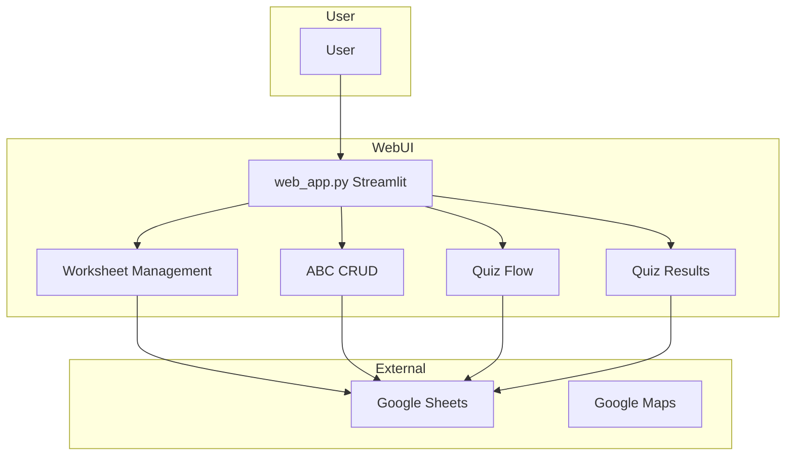

# Project D Web UI

A Streamlit web UI for worksheet management, ABC operations, quiz, and quiz results backed by Google Sheets.

Usage
-----
1. Create and activate a Python environment (recommended).
2. Install dependencies:

   pip install -r requirements.txt

Web UI
------
You can run a browser-based frontend for worksheet management, ABC operations, quiz, and quiz results:

```bash
streamlit run web_app.py
```

Or on Windows PowerShell, run the one-command launcher:

```powershell
.\run_web.ps1
```

The Web UI uses the same Google Sheets environment variables (`GS_CREDS`, `GS_SHEET`, optional `GS_WORKSHEET`).

Web UI Screenshots
------------------
Add screenshots to `docs/screenshots/` and keep these names for automatic display in this section:

- `menu-overview.png`
- `worksheet-management.png`
- `quiz-flow.png`
- `quiz-results.png`

<!-- Replace placeholders below once image files exist -->


Diagrams
--------
High-level flow (Web UI + Google Sheets + Google Maps):



Generated diagram sources (Graphviz DOT):
- [docs/diagrams/high_level_flow.mmd](docs/diagrams/high_level_flow.mmd)
- [docs/diagrams/call_graph.dot](docs/diagrams/call_graph.dot)
- [docs/diagrams/packages.dot](docs/diagrams/packages.dot)
- [docs/diagrams/classes.dot](docs/diagrams/classes.dot)

Rendered diagrams (SVG):
- [docs/diagrams/call_graph.svg](docs/diagrams/call_graph.svg)
- [docs/diagrams/packages.svg](docs/diagrams/packages.svg)
- [docs/diagrams/classes.svg](docs/diagrams/classes.svg)

Files
-----
- `app.py` — shared Google Maps scraping utility used by the Web UI.
- `web_app.py` — Streamlit frontend for the Project D workflows.
- `requirements.txt` — Python dependencies.

Google Sheets persistence
-------------------------
To enable saving/loading to Google Sheets, provide a service account credentials JSON and the spreadsheet ID. Share the spreadsheet with the service account email, then set environment variables for the Web UI:

```bash
setx GS_CREDS "path\to\creds.json"
setx GS_SHEET "your_spreadsheet_id"
```

Optional:

```bash
setx GS_WORKSHEET "Sheet1"
```

Notes
-----
This project is web-UI-only. The legacy CLI has been removed.